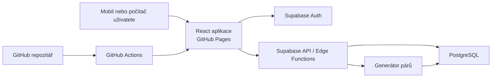

# Aplikace pro docházku, bodování a párování tanečníků

**Pracovní název:** Postřekov – docházka a páry  
**Stav dokumentu:** specifikace MVP v1.0  
**Datum:** 27. 7. 2026  
**Určeno pro:** Národopisný soubor Postřekov

## 1. Účel dokumentu

Tento dokument popisuje businessové zadání, první rozsah aplikace, pravidla bodování
a párování, datový model a doporučený způsob provozu.

Aplikace má nahradit současný Excel používaný pro evidenci účasti. Má současně
pomáhat při výběru lidí na vystoupení a spravedlivě střídat taneční páry s ohledem
na zkušenost a omezení jednotlivých členů.

Dokument je podkladem pro upřesnění pravidel a následnou implementaci. Neuzavřené
otázky jsou uvedeny v kapitole 17.

## 2. Výchozí stav

### 2.1 Současný Excel

Analyzovaný soubor `dochazka sezona léto 2026.xlsx` obsahuje:

- 57 členů;
- rozlišení párovací role hodnotami `M` a `F`;
- zkoušky a vystoupení vedené jako jednotlivé sloupce;
- bodový součet za člena;
- celé účasti typicky hodnocené jedním bodem;
- dílčí účasti vypočtené podle počtu zameškaných minut;
- některé akce s jinou vahou, například dvěma body;
- pomocný list pro přepočet délky zkoušky a minut na podíl bodu.

Aktuální vzorec pro částečnou účast lze shrnout jako:

`body = váha události × (odchozené minuty / plánované minuty)`

V Excelu jsou některé minutové koeficienty zadávány přímo ve vzorcích. Nová
aplikace má místo toho ukládat skutečný čas příchodu/odchodu nebo počet
odchozených minut a body vypočítat jednotným, dohledatelným pravidlem.

### 2.2 Existující web a referenční GitHub projekt

- Veřejný web [postrekovo.cz](https://postrekovo.cz/) je obsahový web souboru.
- Referenční repozitář
  [edudant/chodsky-kroj-postrekov](https://github.com/edudant/chodsky-kroj-postrekov)
  používá React, TypeScript, Vite a automatické nasazení na GitHub Pages pomocí
  GitHub Actions.
- Tento způsob je vhodný pro veřejný statický frontend. Samotné GitHub Pages ale
  nemají databázi, bezpečné přihlášení ani serverovou logiku.

Nová aplikace vizuálně navazuje na web souboru a je realizována samostatně:

- repozitář [edudant/nsp-akce](https://github.com/edudant/nsp-akce);
- adresa [edudant.github.io/nsp-akce](https://edudant.github.io/nsp-akce/);
- vlastní subdoména `dochazka.postrekovo.cz` zůstává volitelná.

## 3. Businessový cíl

Aplikace má zajistit, aby vedení souboru mohlo:

1. rychle a správně zaznamenat účast na zkoušce nebo vystoupení;
2. transparentně zjistit bodový stav členů za vybrané období;
3. evidovat zájem a dostupnost pro plánované vystoupení;
4. navrhnout obsazení akce na základě dostupnosti, bodů a dalších pravidel;
5. pro každou událost vygenerovat spravedlivé taneční páry;
6. střídat začátečníky se zkušenějšími členy;
7. respektovat páry, které spolu nesmějí nebo nechtějí tancovat;
8. omezit příliš časté opakování oblíbených nebo zavedených párů;
9. zachovat historii skutečné účasti, bodů a skutečně odtančených párů.

## 4. Principy řešení

- **Jednoduchost na mobilu:** docházku musí jít zapsat během zkoušky několika
  klepnutími.
- **Spravedlnost s vysvětlením:** návrh párů nesmí být neprůhledná náhoda.
  U každého návrhu musí být možné zobrazit důvod.
- **Člověk rozhoduje:** vedoucí může návrh upravit, pár uzamknout a přepočítat
  zbytek.
- **Historie se nepřepisuje:** oprava minulého záznamu se uloží do auditu.
- **Body nejsou jediným kritériem:** výběr na vystoupení může zohlednit roli,
  zkušenost, program, kroj, kapacitu a rozhodnutí vedoucího.
- **Soukromí:** jména, docházka, preference a zákazy párování jsou osobní údaje.
  Nezabezpečená veřejná stránka je nesmí zpřístupnit.
- **Konfigurovatelnost:** bodové váhy a pravidla párování se nemají zapisovat
  napevno do zdrojového kódu.

## 5. Uživatelé a oprávnění

### 5.1 Administrátor

Typicky vedoucí nebo pověřený správce.

Může:

- spravovat členy;
- zakládat a měnit události;
- zapisovat a opravovat docházku;
- nastavovat bodové váhy;
- evidovat zkušenost, role a omezení;
- generovat, upravovat a potvrzovat páry;
- zobrazit kompletní historii a audit;
- importovat a exportovat data.

### 5.2 Zapisovatel

Může:

- zobrazit členy a události;
- zapisovat docházku;
- zadat skutečně odtančené páry;
- použít generátor párů.

Nemůže měnit uživatele, systémová pravidla ani mazat historická data.

### 5.3 Člen / sdílený náhled

Pro MVP lze použít společný přístupový kód pro celý soubor. Náhled je pouze pro
čtení a může zobrazovat:

- kalendář zkoušek a vystoupení;
- vlastní nebo společný přehled docházky a bodů podle schváleného rozsahu;
- výzvu k potvrzení zájmu o vystoupení;
- zveřejněné páry pro konkrétní událost.

Společné heslo nesmí být uloženo ve zdrojovém kódu frontendu. Aplikace je musí
ověřit na serveru a vydat časově omezené oprávnění.

### 5.4 Veřejný návštěvník bez přístupu

Může případně vidět pouze neosobní informace, například termín veřejného
vystoupení. Jména, docházka, body a páry se bez autorizace nezobrazují.

## 6. Typy událostí

Základní typy:

- **zkouška**;
- **vystoupení**.

Datový model má umožnit pozdější doplnění dalších typů, například soustředění,
školení nebo společenská akce.

Každá událost obsahuje:

- název;
- typ;
- datum a plánovaný začátek/konec;
- místo;
- stav: návrh, otevřená, uzavřená, zrušená;
- bodovou váhu;
- termín pro potvrzení zájmu;
- kapacitu nebo požadovaný počet párů;
- volitelně program/pásmo a poznámku;
- pravidla viditelnosti;
- stav vygenerovaných a potvrzených párů.

## 7. Evidence členů

U člena se eviduje:

- celé zobrazované jméno;
- zkrácené jméno pro mobilní tabulku;
- aktivní/neaktivní;
- párovací role, například tanečník/tanečnice;
- úroveň zkušenosti;
- datum vstupu nebo období aktivního členství;
- volitelná omezení pro konkrétní program;
- interní poznámka;
- oprávnění k přihlášení, pokud má vlastní účet.

Párovací role má být oddělena od pohlaví. Pro algoritmus je důležité, v jaké roli
člověk v daném tanci vystupuje, nikoli jaký osobní údaj o pohlaví má.

### 7.1 Zkušenost

Pro MVP se doporučují tři úrovně:

1. začátečník;
2. pokročilý;
3. zkušený.

Později lze úroveň nahradit číselnou škálou nebo ji určit samostatně pro různá
pásma. Úroveň je interní údaj a v běžném členském náhledu nemusí být viditelná.

## 8. Docházka a bodování

### 8.1 Stavy účasti

Před událostí:

- nezadáno;
- mám zájem / zúčastním se;
- nezúčastním se;
- nevím;
- náhradník.

Po události:

- přítomen celou dobu;
- přítomen částečně;
- nepřítomen;
- omluven;
- účast nezjištěna.

### 8.2 Výpočet bodů

Výchozí pravidlo pro MVP:

`získané body = váha události × podíl účasti`

Kde:

- celá účast má podíl `1`;
- neúčast má podíl `0`;
- částečná účast je `odchozené minuty / plánované minuty`;
- výsledek se zobrazuje na dvě desetinná místa;
- interně se uchovává přesnější hodnota;
- administrátor může body výjimečně přepsat, ale musí uvést důvod.

Váha je vlastností konkrétní události. Výchozí hodnoty je nutné potvrdit:

- běžná zkouška: návrh `1 bod`;
- vystoupení: návrh `1 nebo 2 body` podle významu/délky;
- zrušená událost: `0 bodů`.

### 8.3 Přehled bodů

Přehled musí umět:

- zvolit období nebo sezonu;
- filtrovat podle aktivních členů a párovací role;
- ukázat body, počet celých a částečných účastí a omluvené absence;
- zobrazit rozpad bodů po událostech;
- exportovat CSV/XLSX;
- jasně odlišit body za zkoušky a za vystoupení;
- ukázat datum poslední aktualizace.

Body slouží jako podklad pro rozhodování, nikoli jako automatický nárok na účast.

## 9. Zájem a výběr na vystoupení

Pro plánované vystoupení správce zadá termín, kapacitu a požadované role. Členové
nebo zapisovatel označí dostupnost.

Pracovní postup:

1. administrátor vytvoří vystoupení;
2. členové nebo zapisovatel zaznamenají zájem/dostupnost;
3. aplikace zobrazí kandidáty a jejich body za zvolené období;
4. aplikace upozorní na nedostatek rolí nebo zkušených lidí;
5. vedoucí vybere účastníky a případné náhradníky;
6. pro vybrané účastníky vygeneruje páry;
7. po akci potvrdí skutečnou účast a skutečné páry.

MVP nemusí účastníky vybírat plně automaticky. Vhodnější je seřazený a
vysvětlitelný návrh, který vedoucí potvrdí.

## 10. Preference a omezení párování

Mezi dvěma členy lze uložit:

- **zakázaný pár** – nikdy automaticky nevytvořit;
- **nevhodný pár** – silná penalizace, použít jen při nedostatku možností;
- **preferovaný pár** – mírné zvýhodnění, nikoli trvalé spojení;
- **pevný pár pro událost** – ruční rozhodnutí platné pouze pro danou událost.

Omezení může mít:

- důvod viditelný pouze administrátorům;
- platnost od/do;
- závažnost;
- autora a datum změny.

Citlivý důvod se nesmí zobrazovat ostatním členům. V členském náhledu se zobrazí
pouze výsledný pár.

## 11. Generování párů

### 11.1 Vstupy

Generátor pracuje s:

- účastníky vybranými pro událost;
- jejich párovacími rolemi;
- zkušeností;
- historií skutečně odtančených párů;
- tvrdými zákazy a měkkými preferencemi;
- ručně uzamčenými páry;
- počtem plánovaných tanečních kol;
- pravidly konkrétního programu.

Historie návrhů, které se nakonec netancovaly, nesmí mít stejnou váhu jako historie
potvrzených skutečných párů.

### 11.2 Tvrdá pravidla

Generátor nesmí porušit:

- člověk je v jednom kole nejvýše v jednom páru;
- zakázané páry se nevytvářejí;
- párovací role musejí odpovídat zvolenému typu tance;
- uzamčený pár zůstane beze změny;
- neaktivní nebo nezúčastněný člen se nezařadí;
- v jednom kole se pár neopakuje.

### 11.3 Měkká pravidla

Návrh minimalizuje celkové „náklady“ párování:

- časté společné tancování v historii má vysokou penalizaci;
- nedávné společné tancování má vyšší penalizaci než staré;
- začátečník se pokud možno páruje se zkušeným;
- dvojice dvou začátečníků dostane penalizaci;
- preferovaný pár dostane omezený bonus;
- nevhodný pár dostane vysokou penalizaci;
- dlouhodobě nevyvážený počet partnerů se dorovnává;
- stejný člověk nemá opakovaně zůstávat bez partnera.

Váhy jednotlivých pravidel budou konfigurovatelné administrátorem, ale MVP může
začít s bezpečnými výchozími hodnotami.

### 11.4 Doporučený algoritmus

Pro jedno kolo:

1. vyřadit nezpůsobilé kombinace podle tvrdých pravidel;
2. každé možné dvojici vypočítat penalizační skóre;
3. najít párování s nejnižším celkovým skóre metodou minimálního váženého
   párování;
4. přidat malé deterministické rozlišení při shodném skóre;
5. uložit vysvětlení výsledku.

Pro více kol se postup opakuje s dodatečnou penalizací za páry použité v předchozím
kole stejné události.

Výsledek není náhodný chaos: při stejných vstupech a stejném semínku vznikne stejný
návrh. Tlačítko „jiná varianta“ změní semínko, ale stále respektuje pravidla.

### 11.5 Nevyvážený počet rolí

Je nutné předem domluvit, zda aplikace:

- ponechá někoho jako střídajícího;
- vytvoří trojici;
- dovolí zkušenému člověku tančit ve dvou párech v různých kolech;
- nabídne ruční řešení.

MVP doporučuje vytvořit seznam střídajících se osob tak, aby se tato role v čase
spravedlivě měnila. Generátor musí upozornit, pokud nelze splnit všechna tvrdá
pravidla, a nesmí je potichu porušit.

### 11.6 Vysvětlení návrhu

U páru se zobrazí například:

> Navrženo: společně tančili 1× za posledních 12 měsíců; zkušený + začátečník;
> bez omezení.

U nevyřešené situace:

> Nelze sestavit všechny páry: pro 2 osoby neexistuje povolený protějšek.

## 12. Hlavní obrazovky

### 12.1 Přehled

- nejbližší zkouška a vystoupení;
- chybějící potvrzení zájmu;
- rychlý vstup do zápisu docházky;
- upozornění na nepotvrzené páry;
- aktuální bodový přehled.

### 12.2 Kalendář událostí

- seznam a kalendář;
- filtry zkouška/vystoupení, stav, období;
- detail události;
- kopie předchozí události.

### 12.3 Rychlá docházka

- mobilní seznam členů;
- jedním klepnutím přítomen/nepřítomen;
- volba částečné účasti a času;
- hromadné „všichni přítomni“ s následnou opravou výjimek;
- průběžný součet a kontrola nevyplněných osob;
- uložení konceptu a uzavření docházky.

### 12.4 Body a statistiky

- pořadí nebo abecední seznam;
- období/sezona;
- detail člena;
- rozpad po událostech;
- oddělené body za zkoušky a vystoupení;
- export.

### 12.5 Generátor párů

- výběr účastníků;
- počet kol;
- seznam uzamčených párů;
- tlačítka „vygenerovat“, „jiná varianta“, „uzamknout“ a „potvrdit“;
- vysvětlení každého návrhu;
- upozornění na nesplnitelná pravidla;
- možnost přetáhnout osoby mezi páry.

### 12.6 Členové a pravidla

- aktivní členové a archiv;
- zkušenost a párovací role;
- preference/omezení;
- uživatelská oprávnění;
- audit změn.

## 13. Datový model

Níže je logický model; názvy se mohou při implementaci upravit.

### `members`

- `id`
- `display_name`
- `short_name`
- `pairing_role`
- `experience_level`
- `active_from`, `active_to`
- `is_active`
- `admin_note`
- `created_at`, `updated_at`

### `seasons`

- `id`
- `name`
- `date_from`, `date_to`
- `is_current`

### `events`

- `id`
- `season_id`
- `type`
- `title`
- `location`
- `starts_at`, `ends_at`
- `status`
- `points_weight`
- `capacity`
- `required_pairs`
- `response_deadline`
- `visibility`
- `created_by`, `created_at`, `updated_at`

### `event_responses`

- `event_id`
- `member_id`
- `response` (`yes`, `no`, `maybe`, `substitute`)
- `note`
- `responded_at`

### `attendance`

- `event_id`
- `member_id`
- `status`
- `arrived_at`, `left_at`
- `minutes_present`
- `calculated_points`
- `points_override`
- `override_reason`
- `confirmed_by`, `confirmed_at`

### `pairing_preferences`

- `member_a_id`
- `member_b_id`
- `kind` (`forbidden`, `discouraged`, `preferred`)
- `strength`
- `valid_from`, `valid_to`
- `private_reason`
- `created_by`, `updated_at`

Kombinace osob se ukládá vždy v jednotném pořadí ID, aby nevznikly duplicitní
záznamy A–B a B–A.

### `pairing_runs`

- `id`
- `event_id`
- `seed`
- `algorithm_version`
- `rules_snapshot`
- `status` (`draft`, `published`, `superseded`)
- `generated_by`, `generated_at`

### `event_pairs`

- `pairing_run_id`
- `round_number`
- `member_a_id`
- `member_b_id`
- `is_locked`
- `is_confirmed_actual`
- `explanation`
- `manual_change_reason`

### `users` a `user_roles`

- přihlašovací identita;
- vazba na člena, je-li potřebná;
- role administrátor/zapisovatel/člen.

### `audit_log`

- kdo;
- kdy;
- jaký typ záznamu;
- ID záznamu;
- původní a nová hodnota;
- důvod změny.

## 14. Doporučená architektura

### 14.1 Doporučení pro MVP

**Frontend**

- React + TypeScript + Vite;
- responzivní web/PWA;
- zdrojový kód na GitHubu;
- automatický build přes GitHub Actions;
- hosting na GitHub Pages;
- hash routing nebo korektní fallback pro SPA;
- vlastní subdoména `dochazka.postrekovo.cz` je volitelná.

**Backend**

- Supabase;
- PostgreSQL databáze;
- Supabase Auth pro administrátory a zapisovatele;
- Row Level Security pro oddělení oprávnění;
- Edge Function nebo databázová funkce pro ověření sdíleného přístupového kódu;
- serverová funkce pro generování/potvrzení párů a audit citlivých změn.

**Proč tato kombinace**

- GitHub Pages zůstane stejně jednoduchý jako u referenčního projektu;
- není třeba spravovat vlastní server;
- databáze, zálohy, přihlášení a oprávnění nejsou simulovány ve frontendovém
  kódu;
- řešení lze později přesunout na jiný hosting bez změny datového modelu.

### 14.2 Schéma

### 14.3 Proč nestačí samotné GitHub Pages

GitHub Pages poskytuje pouze statické soubory. Kód i vložené hodnoty si může
návštěvník stáhnout. Proto na ně nelze bezpečně uložit:

- společné heslo;
- administrátorské přihlášení;
- databázové servisní klíče;
- zapisovatelnou docházku;
- neveřejné preference členů.

Technicky lze vytvořit aplikaci s daty pouze v prohlížeči, ale data by nebyla
spolehlivě sdílená mezi uživateli a ochrana by byla jen zdánlivá.

### 14.4 Alternativy

| Varianta | Výhody | Nevýhody | Doporučení |
|---|---|---|---|
| GitHub Pages + Supabase | Jednoduché nasazení, PostgreSQL, Auth, malé provozní nároky | Dvě služby, je nutné správně nastavit RLS | Doporučené MVP |
| Cloudflare Pages + Workers + D1 | Frontend i backend v jedné platformě, levný provoz | Více vlastní serverové logiky, jiné SQL limity | Dobrá alternativa |
| Vercel/Netlify + Supabase | Snadné serverless funkce a SPA routing | Další platforma mimo GitHub Pages | Vhodné, pokud budou složitější API funkce |
| Vlastní VPS + PostgreSQL | Plná kontrola | Aktualizace, zálohy, bezpečnost a dohled jsou na provozovateli | Pro MVP nedoporučeno |
| Pouze GitHub Pages | Téměř nulový provoz | Bez bezpečného hesla, databáze a zápisu | Pro tuto aplikaci nevhodné |

### 14.5 Prostředí a nasazení

Doporučená prostředí:

- lokální vývoj;
- testovací Supabase projekt a testovací URL;
- produkční Supabase projekt a produkční URL.

GitHub Actions při změně větve `main`:

1. nainstaluje závislosti;
2. spustí typovou kontrolu, testy a build;
3. nasadí statický frontend na GitHub Pages.

Změny databázového schématu se vedou jako verzované migrace v repozitáři.
Produkční tajné klíče se ukládají pouze do zabezpečených proměnných platformy,
nikoli do repozitáře.

## 15. Bezpečnost, soukromí a provoz

- Veřejný GitHub repozitář nesmí obsahovat členská data ani export produkční
  databáze.
- Frontend smí obsahovat pouze veřejný Supabase `anon` klíč; přístup k datům musí
  omezit RLS politiky.
- Servisní klíč je pouze na serverové funkci.
- Hesla se ukládají výhradně jako bezpečné hashe prostřednictvím autentizační
  služby.
- Sdílený přístupový kód se pravidelně mění a lze jej okamžitě zneplatnit.
- Administrátorské účty mají být osobní, nikoli jeden společný účet.
- Citlivé důvody omezení párů vidí pouze administrátor.
- Změny docházky, bodů a omezení se auditují.
- Je nutné určit dobu uchování dat a osobu odpovědnou za správu.
- Před zveřejněním jmen a bodů členům je vhodné stanovit interní pravidla a právní
  titul zpracování osobních údajů.

### Zálohy a obnova

- automatické zálohy podle možností zvoleného tarifu databáze;
- alespoň měsíční export do CSV/SQL uložený mimo veřejný repozitář;
- před větší migrací ruční export;
- jednou za sezonu ověřit, že lze data obnovit;
- export událostí, docházky, bodů a párů musí být dostupný administrátorovi.

## 16. Rozsah realizace

### Fáze 0 – potvrzení pravidel

- projít otázky v kapitole 17;
- potvrdit bodování a viditelnost údajů;
- určit administrátory;
- připravit seznam členů a význam historických sloupců Excelu.

### Fáze 1 – MVP evidence

- přihlášení administrátora/zapisovatele;
- členové a sezony;
- zkoušky a vystoupení;
- rychlá docházka včetně částečné účasti;
- automatický výpočet bodů;
- přehled a export;
- import stávajícího Excelu;
- audit základních změn.

### Fáze 2 – zájem a párování

- dostupnost/zájem o vystoupení;
- zkušenost a omezení párů;
- generování jednoho a více kol;
- uzamčení a ruční úpravy;
- publikace návrhu;
- potvrzení skutečně odtančených párů;
- historie a vysvětlení.

### Fáze 3 – členský náhled a vylepšení

- sdílený kód nebo osobní členské účty;
- notifikace;
- PWA/offline koncept docházky;
- statistiky spravedlnosti párování;
- případné napojení na veřejný web.

## 17. Otevřené otázky k rozhodnutí

### Body a docházka

1. Je jedna celá zkouška vždy za 1 bod?
2. Podle čeho mají vystoupení váhu 1 nebo 2 body?
3. Počítá se částečná účast přesně po minutách, nebo v pásmech?
4. Dostává omluvená absence nějaké body?
5. Rozhoduje pro výběr aktuální sezona, posledních 6/12 měsíců, nebo oba pohledy?
6. Mají se body za zkoušky a vystoupení sčítat, nebo zobrazovat odděleně?

### Výběr na vystoupení

7. Potvrzuje zájem každý člen sám, nebo jej zapisuje vedoucí?
8. Je bodové pořadí jen informace, nebo má pevně určovat pořadí?
9. Jaké další podmínky rozhodují: pásmo, kroj, zkušenost, věk, role, doprava?
10. Mají členové vidět body všech ostatních, nebo pouze vlastní body?

### Párování

11. Jsou párovací role vždy dvě a pevně dané?
12. Kolik úrovní zkušenosti je potřeba?
13. Za jak dlouhé období se má opakování párů penalizovat?
14. Existují trvalé páry, které se na vystoupení nemají rozdělovat?
15. Co se má stát při lichém nebo nevyváženém počtu rolí?
16. Mohou členové zadávat preference sami, nebo pouze vedoucí?
17. Má být zákaz páru absolutní za všech okolností?
18. Počítá se do historie návrh, nebo pouze potvrzený skutečně odtančený pár?

### Přístup a soukromí

19. Co přesně smí vidět člověk se společným přístupovým kódem?
20. Má být kalendář bez jmen veřejný?
21. Stačí pro MVP jeden společný kód pro čtení a osobní účty správců?
22. Kdo bude oprávněn měnit citlivá omezení párů?

## 18. Akceptační kritéria MVP

MVP je přijatelné, pokud:

- administrátor vytvoří událost a nastaví její bodovou váhu;
- zapisovatel na telefonu označí docházku všech aktivních členů;
- částečná účast se správně přepočítá podle délky události;
- součet bodů lze ověřit proti detailu jednotlivých událostí;
- oprava bodů vyžaduje důvod a objeví se v auditu;
- lze filtrovat sezonu a exportovat data;
- běžný návštěvník nezíská neveřejná členská data;
- role v databázi zabrání zapisovateli měnit systémová nastavení;
- historická data z Excelu lze importovat bez ztráty jmen, rolí, událostí a bodů;
- aplikace je použitelná na běžném mobilním telefonu;
- databázi lze zazálohovat a obnovit.

Fáze párování je přijatelná, pokud:

- generátor nikdy nevytvoří zakázaný pár;
- respektuje ručně uzamčené páry;
- preferuje kombinaci začátečníka se zkušenějším členem;
- omezuje nedávno opakované dvojice;
- při stejných vstupech umí výsledek zopakovat;
- ke každému páru zobrazí stručné vysvětlení;
- při nedostatku možných dvojic zobrazí problém a neporuší pravidla potichu;
- vedoucí může návrh ručně upravit a potvrdit skutečný stav.

## 19. Testování

Minimální automatické testy:

- výpočet celé, nulové a částečné účasti;
- různé délky událostí a váhy;
- zaokrouhlování;
- oprávnění jednotlivých rolí;
- zákaz přístupu k cizím/neveřejným datům;
- zákaz páru;
- uzamčený pár;
- začátečník + zkušený;
- opakované dvojice;
- lichý a nevyvážený počet rolí;
- reprodukovatelnost párování;
- import reprezentativního vzorku Excelu.

U generátoru je vhodné testovat nejen jednotlivé příklady, ale i vlastnosti:
žádný člověk není v jednom kole dvakrát, nevzniká zakázaný pár a počet vytvořených
párů je maximální možný.

## 20. Navržené další kroky

1. Společně projít a rozhodnout otázky v kapitole 17.
2. Označit v kopii Excelu, které sloupce jsou zkoušky a které vystoupení, a doplnit
   rok/délku/váhu událostí.
3. Potvrdit, co u členů znamenají hodnoty `M` a `F`.
4. Vybrat model přístupu: osobní správci + společný kód pro čtení je doporučené
   minimum.
5. Založit samostatný GitHub repozitář a testovací Supabase projekt.
6. Vytvořit klikací prototyp obrazovek rychlé docházky a generátoru párů.
7. Implementovat MVP evidence před algoritmem párování.
8. Na reálné historii ověřit a doladit váhy párovacího algoritmu.
